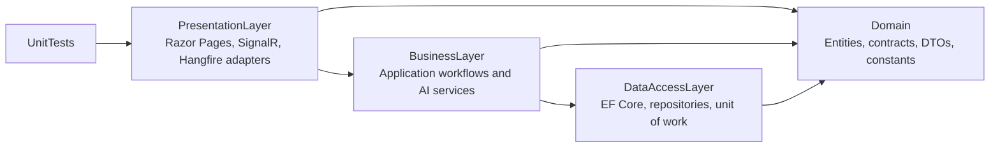

# EduChatAI

EduChatAI is a Vietnamese educational knowledge-base and retrieval-augmented chat application. It combines subject and membership management, document indexing, cited AI chat, experiment runs, adoption-and-health reports, authentication, and partial subscription/payment foundations in one ASP.NET Core application.

The repository is under active development. Docker Compose is the primary local setup; host and Visual Studio workflows are also supported.

## Feature status

| Area | Current behavior |
| --- | --- |
| Accounts and access | ASP.NET Core Identity, email verification, Google sign-in, Admin/Lecturer/Student roles, subject memberships, and account administration |
| Knowledge base | Subject and chapter management; PDF, DOCX, and PPTX reception; local staging; local or Supabase durable storage; background parsing, chunking, embedding, and pgvector indexing |
| AI configuration | Global defaults plus nullable per-subject overrides for chunking, retrieval, chat, title, and citation settings; subject re-indexing with availability state |
| Chat | Fixed-subject and flexible sessions, streamed answers, selected response variants, retry/regeneration, citations, immutable retrieved-context snapshots, and nullable provider metrics |
| Experiments | Admin-only DB201 experiment creation, 50-question Vietnamese dataset, compatibility preflight, optional re-indexing, progress/results, and comparison of two compatible completed runs |
| Admin reports | Admin-only 7-day, 30-day, and all-time adoption/health dashboard with role and trend-subject filters, UTC+7 reporting day trends, subject usage, indexing health, and hot documents |
Subscription and payment foundations | Plan, plan-option, purchase, subscription, transaction, and partial ZaloPay-facing flows are present. Runtime quota metering and enforcement, complete entitlement lifecycle verification, and production VNPay, domestic-card, and international-card gateway integrations are not complete. |
| Automated verification | NUnit unit, mapping, PageModel, service, and opt-in PostgreSQL integration tests; browser automation is not currently part of the suite |

## Architecture



`Domain` owns shared entities and contracts. `DataAccessLayer` owns persistence. `BusinessLayer` owns application workflows. `PresentationLayer` owns web, realtime, dependency-injection, and background-job adapters.

The intended persistence boundary is `IUnitOfWork`. The two EF Core contexts are currently public because startup configures and migrates them directly, and a small amount of existing integration code also consumes a context. Treat that as technical debt: new business and presentation features should not introduce direct `DbContext` access when the unit-of-work boundary can express the operation.

## Technology

| Area | Current stack |
| --- | --- |
| Runtime and web | .NET 10, ASP.NET Core Razor Pages, jQuery, Tailwind CSS 4 |
| Data | EF Core 10, PostgreSQL 18, Npgsql, pgvector |
| Authentication | ASP.NET Core Identity, cookie authentication, Google OAuth |
| Background work | Hangfire with PostgreSQL storage |
| Realtime | SignalR |
| AI | `Microsoft.Extensions.AI`, Ollama, OpenRouter, Gemini |
| Storage and cache | Local file buffers, Supabase Storage, Redis, RedisInsight |
| Document parsing | PdfPig, Open XML, and text/HTML parsers |
| Tests | NUnit, Moq, optional disposable-PostgreSQL integration tests |

## Repository layout

```text
EduChatAI.slnx
|- Domain/               Entities, contracts, constants, DTOs, and exceptions
|- DataAccessLayer/      EF Core contexts, migrations, repositories, seeding, unit of work
|- BusinessLayer/        Account, document, AI, report, subscription, and payment services
|- PresentationLayer/    Razor Pages, SignalR hubs, Hangfire jobs, mappings, and static assets
|- UnitTests/            Unit, PageModel, mapping, and gated PostgreSQL integration tests
|- docker-compose.yml    CPU-portable development stack
|- docker-compose.gpu.yml
`- PresentationLayer/Dockerfile
```

## Prerequisites

### Docker workflow

- Docker Desktop or another Docker Engine with Docker Compose.
- Integration credentials for the provider-backed features you intend to use.
- An NVIDIA-compatible Docker runtime only for the optional GPU override.

The regular Docker build does not require the .NET SDK or Node.js on the host. Tailwind CSS is built in the Dockerfile's Node asset stage.

### Host or Visual Studio workflow

- .NET 10 SDK.
- Node.js 24-compatible npm tooling.
- Docker or local PostgreSQL with pgvector, Redis, and optionally Ollama.
- EF Core CLI only when creating, inspecting, or applying migrations: `dotnet tool install --global dotnet-ef`.

## Configuration and secrets

Copy [.env.example](.env.example) to `.env` for CLI Compose. Never commit the populated file.

```powershell
Copy-Item .env.example .env
```

```bash
cp .env.example .env
```

ASP.NET Core maps double underscores to nested keys. For example, `AI__Gemini__ApiKey` maps to `AI:Gemini:ApiKey`.

| Configuration | When it is needed |
| --- | --- |
| `ConnectionStrings:Database` | Required. The host must reach PostgreSQL with pgvector support. Compose supplies its own container connection. |
| `Redis:ConnectionString` | Required for normal operation; defaults to `localhost:6379` when omitted. Compose uses `redis:6379`. |
| `AI:Ollama:Endpoint` | Required as a configured section; the Ollama service/model is needed only when an Ollama model is selected. |
| `AI:OpenRouter:*`, `AI:Gemini:*` | Their clients are registered at startup. Supply nonempty API keys for reliable startup and for any selected remote model. |
| `BlobStorage:Supabase:*` | The section and a valid endpoint are configured at startup. A real secret and bucket are needed when Supabase storage is selected. |
| `Authentication:Google:*` | Real values are required only for Google sign-in. |
| `Email:*` | Real SMTP values are required for verification, reset, and administration emails. |
| `PaymentProviders:ZaloPay:*`, `AppBaseUrl` | Real, externally reachable values are required for provider callback flows. |
| `DemoData:AdminReports:Enabled` | Optional, Development-only report history; default is `false`. |

For host and Visual Studio runs, use the Presentation project's .NET User Secrets instead of editing `appsettings.json`:

```bash
dotnet user-secrets set --project PresentationLayer/Presentation.csproj "AI:OpenRouter:ApiKey" "<value>"
dotnet user-secrets set --project PresentationLayer/Presentation.csproj "AI:Gemini:ApiKey" "<value>"
dotnet user-secrets set --project PresentationLayer/Presentation.csproj "BlobStorage:Supabase:ApiSecretKey" "<value>"
```

The tracked Compose database password is a disposable local-development credential, not a deployment secret.

## Quick start with Docker Compose

1. Copy `.env.example` to `.env` and fill the required integration values.
2. Start the CPU-portable stack:

   ```bash
   docker compose up --build
   ```

3. When an Ollama model is selected, pull it into the persistent Ollama volume:

   ```bash
   docker exec educhatai_ollama ollama pull bge-m3
   docker exec educhatai_ollama ollama pull qwen3
   ```

4. Open the application at `http://localhost:8080`.

For NVIDIA GPU acceleration:

```bash
docker compose -f docker-compose.yml -f docker-compose.gpu.yml up --build
```

| URL | Development service |
| --- | --- |
| `http://localhost:8080` | EduChatAI |
| `http://localhost:8080/hangfire` | Admin-authorized Hangfire dashboard |
| `http://localhost:5540` | RedisInsight |
| `http://localhost:11434` | Ollama API |

PostgreSQL and Redis are exposed on host ports `5432` and `6379` for development tools.

Useful commands:

```bash
docker compose ps
docker compose logs -f web
docker compose down
```

`docker compose down -v` is an explicit destructive reset: it deletes the local PostgreSQL and Ollama volumes.

## Host development

Start infrastructure, install frontend packages, and run the web project:

```bash
docker compose up -d db redis ollama
npm ci --prefix PresentationLayer
dotnet restore EduChatAI.slnx
dotnet run --project PresentationLayer/Presentation.csproj
```

Default launch URLs are `http://localhost:5158` and `https://localhost:7265`.

A normal project build runs `npm run tailwind:build`. Backend-only verification may skip that target explicitly:

```bash
dotnet build EduChatAI.slnx -p:SkipTailwindBuild=true
```

## Visual Studio Docker debugging

- Use the Docker Compose project as the startup project.
- CLI Compose reads `.env`; the Visual Studio override resets `env_file` and mounts User Secrets so those secrets remain authoritative.
- Visual Studio Fast mode targets the Dockerfile's first `base` stage. Keep that stage first.
- The Visual Studio override publishes HTTPS on `https://localhost:8081`.
- `docker-compose.gpu.yml` is included by the Compose project, so Visual Studio debugging requests GPU-backed Ollama.
- `DependencyAwareStart` is intentionally not enabled because it tears down the Compose containers when debugging stops.
- Fast-mode host builds still execute the Tailwind npm target, so Node.js is required on the host.

## Development startup behavior

In `Development`, startup:

1. checks and applies pending migrations for `EduChatAiDbContext`;
2. seeds roles, development users, plans, subjects, chapters, starter documents/chats, and a global AI configuration when absent;
3. imports the embedded DB201 Vietnamese experiment dataset idempotently;
4. optionally refreshes reserved admin-report demo rows;
5. checks and applies the data-protection context migrations.

Production startup does not run these migration and seed calls. Apply production migrations as a separate deployment operation.

The optional historical report dataset is Development-only, disabled by default, and refreshes only reserved demo rows inside a transaction. Do not point it at a shared database.

```powershell
$env:DemoData__AdminReports__Enabled = "true"
dotnet run --project PresentationLayer/Presentation.csproj
```

For Compose, use its explicit alias:

```powershell
$env:EDUCHATAI_DEMO_ADMIN_REPORTS_ENABLED = "true"
docker compose up --build
```

The generated history covers 60 UTC+7 calendar days and is designed to populate every dashboard section. Unset the flag or set it to `false` for normal startup.

## Background jobs and realtime endpoints

Hangfire uses PostgreSQL storage and three ordered queues:

| Queue | Work |
| --- | --- |
| `0_high` | Chat answer generation |
| `1_medium` | Chat title generation and user imports |
| `2_low` | Document persistence/indexing, subject re-indexing, and experiments |

Retry counts are declared on each job; do not assume Hangfire's global retry default. Chat answers, subject re-indexing, and experiments currently have no automatic retry.

| SignalR path | Purpose |
| --- | --- |
| `/resource` | Resource and collection changes |
| `/documents/status` | Document processing status |
| `/chat/answer` | Chat generation and variants |
| `/documents/comments` | Document comment updates |

## AI configuration and document indexing

The effective AI configuration resolves each nullable subject setting over the global default. The seeded chunk defaults are `FixedLength`, size `1000`, and overlap `200`; admins can select fixed-length, recursive-separator, or sentence/paragraph chunking.

A successful document index records its chunking strategy, chunk size, overlap, and embedding model. These four values form the persisted index identity. Unknown or incompatible values require a safe re-index; retrieval-only settings such as `TopK` do not identify the stored vector index.

Each subject is `Ready`, `Reindexing`, or `Failed`. Chat refuses generation for any selected/accessible subject whose index is not `Ready`. Re-index operations acquire an exclusive subject state transition, process documents deterministically, and update the availability when the run succeeds or fails.

Document flow:

```text
HTTP upload
  -> validate and stage bytes
  -> create Document (Received)
  -> Hangfire durable-persistence job
  -> Hangfire parse/chunk/embed job
  -> PostgreSQL/pgvector index
  -> retrieval, cited chat, reports, and experiments
```

Documents belong to one subject and may be tagged with that subject's chapters. Database constraints prevent cross-subject document/chapter links. The chosen durable storage method is persisted on each document.

## Chat behavior

A chat session is either:

- **fixed-subject**: `ChatSession.SubjectId` is a positive subject ID and generation is restricted to that subject; or
- **flexible**: `ChatSession.SubjectId` is `null` and each generation resolves the owner's current accessible subjects from memberships.

Flexible does not mean unrestricted. A user must have at least one accessible subject to create the session, and later membership changes affect future generations.

Each user turn and pending assistant reply are created atomically in adjacent logical message slots. Regeneration creates another assistant variant for the same reply slot and selects it; normal history includes only the selected completed variant. Retrying a failed assistant message retains its identity but clears generated content, metrics, citations, and retrieved-context snapshots before running again.

Generation embeds the user question, retrieves allowed subject chunks, inserts at most `MaxContextChunks` into the prompt in order, streams the answer through SignalR, and stores exact ordered context snapshots. Citation markers are resolved only against those retrieved chunks; a second structured model call may store supporting-quote occurrences. Provider token and first-token measurements remain `null` when the provider does not supply them.

## Experiments

The current experiment workflow is Admin-only and intentionally restricted to DB201. Startup imports the embedded `db201-vi-50-v1` dataset with 50 Vietnamese questions and reference answers.

1. The create page requires deliberate generation and judge-model choices.
2. Preflight reports whether the requested chunking/embedding identity is compatible and how many documents are affected.
3. A compatible run starts questions without re-indexing.
4. An incompatible run changes the active DB201 configuration, marks the subject as re-indexing, processes the affected documents, and starts questions automatically when indexing succeeds.
5. The results page polls `Queued`, `PreparingIndex`, `Running`, `Evaluating`, `Completed`, or `Failed` progress and shows per-question failures without requiring every question to succeed.
6. Comparison accepts exactly two completed runs from the same subject and question set.

The evaluator is an in-process C# **RAGAS-style** LLM judge that scores faithfulness, answer relevancy, context precision, and context recall from immutable question, answer, and retrieved-context snapshots. It is not the official Python RAGAS package. Experiment execution is serial and has no automatic Hangfire retry; do not promise a fixed completion time.

## Admin reports

The Admin-only dashboard offers required timeframes (7 days, 30 days, all time), a role filter, and an optional trend-subject filter. Daily boundaries and zero-filled dates use the Indochina Time calendar.

- No trend subject means all chat activity.
- A positive trend subject ID filters only the three daily trend series.
- Query sentinel `trendSubjectId=0` means only flexible (`SubjectId == null`) sessions. Real subject IDs are positive.
- Subject ranking and the subject table remain cross-subject even when trends are filtered.

The dashboard reports unique active users, active sessions, completed and terminal generations, success rate, citation coverage, token totals with measurement coverage, nearest-rank p95 response time, daily trends, subject usage, subject health, current document indexing state, and hot documents. All completed assistant variants count in generation/token totals, including regenerated variants. Token totals require both prompt and completion counts; unavailable measurements are not reported as zero. Flexible activity contributes to global metrics and has its own usage row, but is excluded from per-subject health because it cannot be attributed to one subject.

## EF Core migrations

Migrations live in `DataAccessLayer/Migrations`.

```bash
dotnet ef migrations add <MigrationName> --project DataAccessLayer --startup-project PresentationLayer
dotnet ef database update --project DataAccessLayer --startup-project PresentationLayer
dotnet ef migrations has-pending-model-changes --project DataAccessLayer --startup-project PresentationLayer --context EduChatAiDbContext
```

Review forward and reverse SQL before applying a migration. Timestamped entities use database-generated `CreatedAt` and the lowercase PostgreSQL `update_timestamp()` trigger for `UpdatedAt`. Never update a shared database as a side effect of generating or testing a migration.

## Tests

Minimum local verification:

```bash
dotnet restore EduChatAI.slnx
dotnet build EduChatAI.slnx --no-restore -p:SkipTailwindBuild=true
dotnet test EduChatAI.slnx --no-build --no-restore
```

The normal solution test result must be interpreted together with its skipped-test count. PostgreSQL integration tests are only meaningful when `EDUCHATAI_PHASE2_TEST_DATABASE` points to an explicitly disposable database, and browser/UI automation is not currently part of the suite.

PostgreSQL integration fixtures are skipped unless `EDUCHATAI_PHASE2_TEST_DATABASE` points to an explicitly disposable PostgreSQL database. The fixtures create, migrate, and clean test state; never point this variable at development, shared, or production data.

```powershell
$env:EDUCHATAI_PHASE2_TEST_DATABASE = "<disposable PostgreSQL connection string>"
dotnet test UnitTests/UnitTests.csproj --no-build --no-restore
```

`ContractFixtureSerializationTests` also requires the local, Git-ignored `.agents` contract fixtures and is intentionally ignored when they are unavailable. Browser/UI automation is currently deferred, so complete feature work still requires focused browser smoke testing.

## Suggested demo smoke flow

1. Start the Development stack and confirm migration/seeding logs complete.
2. Sign in with an appropriate locally seeded or newly created role; do not publish development credentials.
3. As Admin, inspect AI configuration and the DB201 subject.
4. As Lecturer/Admin, upload a PDF, DOCX, or PPTX and wait for `Indexed` through the document status UI or Hangfire.
5. Ask a cited question in a fixed DB201 chat, regenerate the answer, and switch variants.
6. Create a flexible chat and confirm it searches only the user's current memberships.
7. As Admin, create a small DB201 experiment, observe progress, then compare two compatible completed runs.
8. Enable the optional historical seed on a disposable local database and inspect all report ranges, role filters, DB201 trends, and flexible-session trends.

## Known limitations

- **TXT and HTML upload defect:** the allow-list includes `text/plain` and `text/html`, but the current signature-based MIME inspector does not identify formats without a reliable byte signature. These uploads are rejected as unsupported. PDF, DOCX, and PPTX are the reliable demo formats.
- Development startup automatically migrates and seeds. This is a local-development convenience, not a production deployment strategy, and it should not target a shared database casually.
- Experiments are currently DB201-only, run serially per subject, use one live subject index, and leave the selected configuration active after completion.
- Question-level generation or evaluation failures do not necessarily stop later questions. A run currently completes when at least one question evaluates successfully; failed questions are excluded from aggregate scores, while a run fails when every question fails.
- Experiment configuration and retrieved contexts are snapshotted, but the associated `TestQuestion` question and ground-truth text remain mutable database data. Editing or reimporting the dataset can therefore change how an older run is displayed or reconstructed.
- Experiment jobs do not currently provide complete stale-run detection, automatic restart, or idempotent resume after interruption in `PreparingIndex`, `Running`, or `Evaluating`.
- The evaluator is an in-process C# RAGAS-style structured-output judge, not the official Python RAGAS package. A future Python evaluator remains an undecided extension until its process boundary, schemas, versions, recovery behavior, and deployment requirements are approved.
- Flexible chat sessions are dynamically scoped to the owner’s current subject memberships for every generation. Membership changes can alter the retrieval scope of an existing session, including regeneration of an older turn. - Exact retrieved-context text is persisted for chat and experiment reproducibility. This duplicates source content and can outlive later source-document edits; a formal retention, deletion, and redaction policy has not yet been established.
- Subscription and payment support is foundational rather than complete. Plan quota and capability fields describe intended benefits but are not proof of atomic usage accounting, runtime enforcement, or complete premium entitlement activation.
- A passing default test run does not by itself prove PostgreSQL repository behavior or browser end-to-end behavior. Database-gated tests require an explicitly disposable PostgreSQL database, and browser automation is currently deferred.
- Public EF Core contexts and remaining direct context consumers are layering technical debt; new code should prefer `IUnitOfWork` and focused repositories.
- External email, Google, Supabase, AI-provider, and ZaloPay paths depend on valid third-party credentials and reachable endpoints.

## Security and operating notes

- Never commit `.env`, User Secrets, API keys, database connection strings, email credentials, OAuth secrets, or payment signing keys.
- Use disposable databases for migrations, integration tests, and demo-data refreshes.
- Admin pages and the Hangfire dashboard enforce role checks; preserve authorization when adding handlers or links.
- Keep subject membership checks on document and chat paths. A flexible chat is dynamically scoped, never globally scoped.
- Escape user/server text inserted into client templates and do not trust model-authored citation indices without resolving them against retrieved chunks.
- Production must provide configuration through its environment or secret manager, use HTTPS, and apply migrations as an explicit deployment step.
