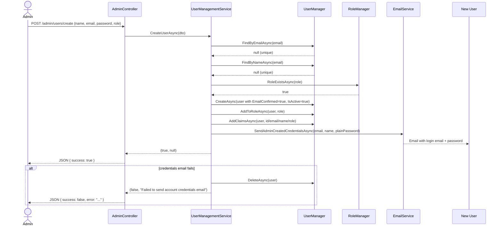
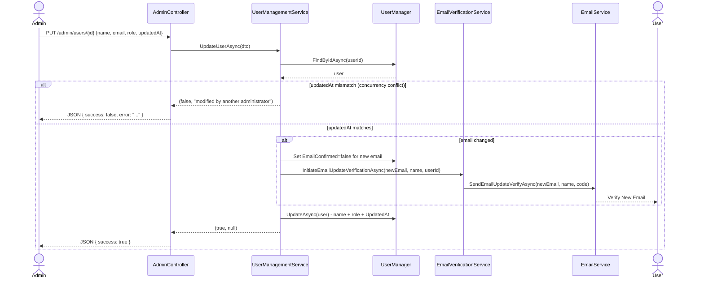
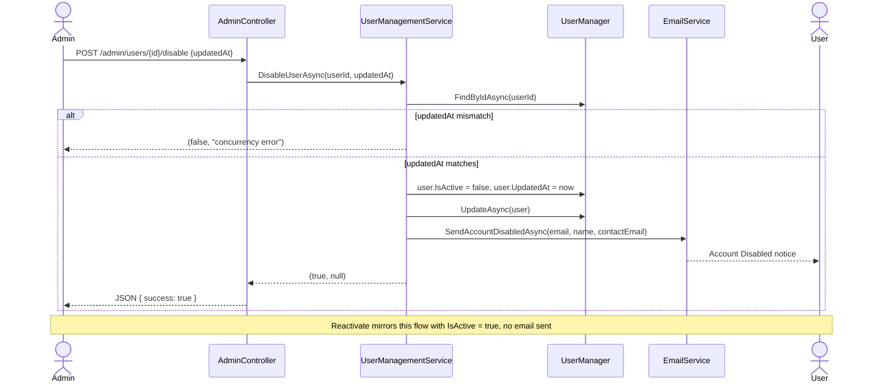
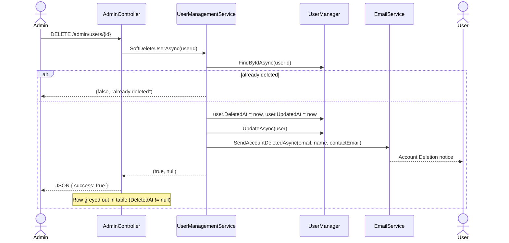

# Admin User Management - Feature Flows

Sequence diagrams for admin user-management operations.

---

## 1. Create User Flow

Admin-created accounts are created as active accounts immediately. The system sets
`EmailConfirmed = true` and emails the initial credentials to the user. This flow
does not create OTP codes and does not use Redis.



---

## 2. Update User Flow



---

## 3. Disable / Reactivate User Flow



---

## 4. Soft-Delete User Flow



---

## Redis Key Schema

Create-user no longer uses Redis. Redis remains only for self-registration OTP and
email-update verification.

| Key | TTL | Contents | Flow |
|-----|-----|----------|------|
| `otp:{email}` | 3 min | `{code, verifyAttempts}` | Self-register, email update |
| `otp:send_count:{email}` | 1 hr | Rate limit counter (max 5) | OTP sending |
| `pending_reg:{email}` | 30 min | `{fullName, bcryptHash}` | Self-register |
| `pending_email_update:{newEmail}` | 30 min | `{userId, fullName}` | Email update |

---

## Optimistic Concurrency Protection

All state-mutating operations except Create and Soft Delete require the client to
send the current `UpdatedAt` value. Before saving, the service re-reads the entity
and compares:

```csharp
if (user.UpdatedAt != dto.UpdatedAt)
    return (false, "modified by another administrator. Please refresh.");
```

This prevents two admins from silently overwriting each other's changes.
