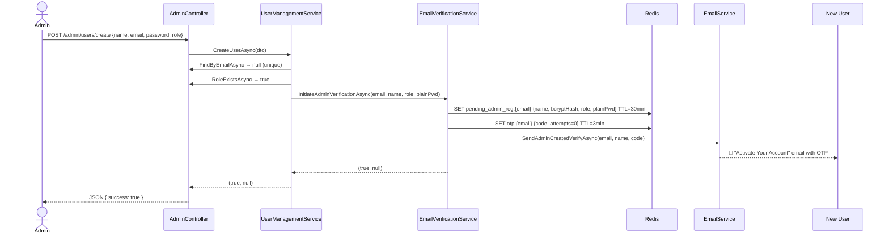
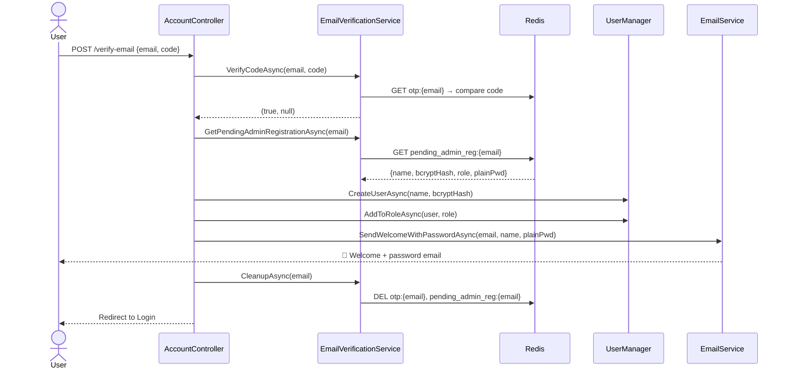
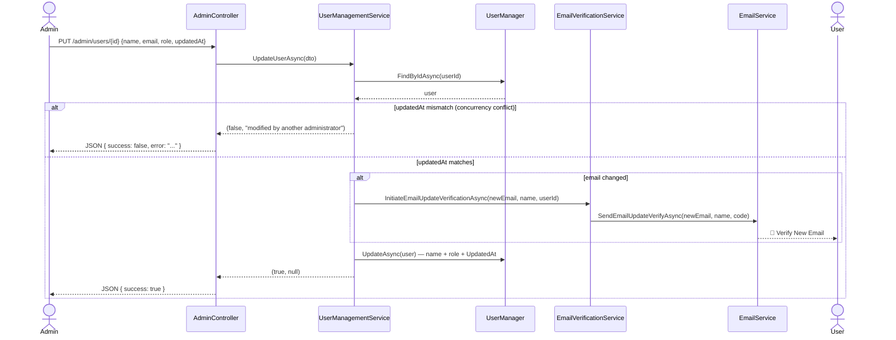
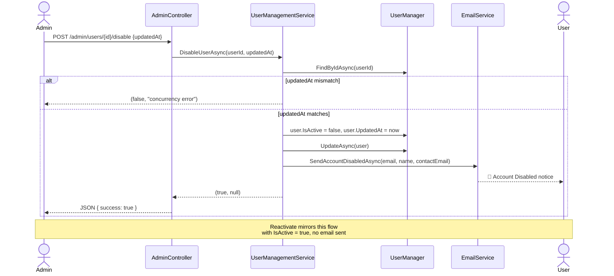
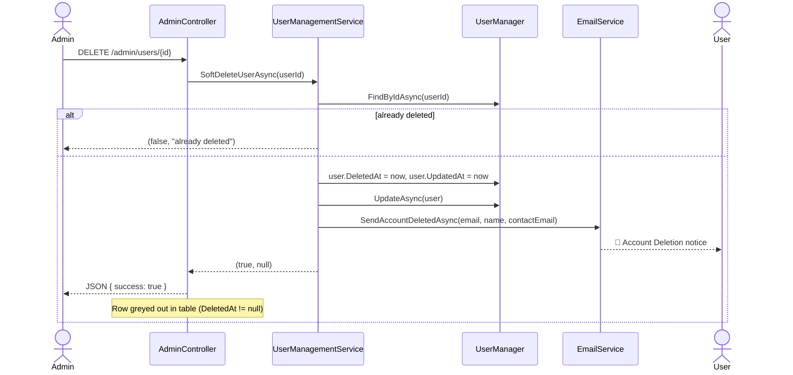

# Admin User Management — Feature Flows

Sequence diagrams for all 5 admin operations.

---

## 1. Create User Flow



---

## 2. Email Verification → Account Activation



---

## 3. Update User Flow



---

## 4. Disable / Reactivate User Flow



---

## 5. Soft-Delete User Flow



---

## Redis Key Schema

| Key | TTL | Contents | Flow |
|-----|-----|----------|------|
| `otp:{email}` | 3 min | `{code, verifyAttempts}` | All flows |
| `otp:send_count:{email}` | 1 hr | Rate limit counter (max 5) | All flows |
| `pending_reg:{email}` | 30 min | `{fullName, bcryptHash}` | Self-register |
| `pending_admin_reg:{email}` | 30 min | `{fullName, bcryptHash, role, plainPassword}` | Create user |
| `pending_email_update:{newEmail}` | 30 min | `{userId, fullName}` | Email update |

---

## Optimistic Concurrency Protection

All state-mutating operations (Update, Disable, Reactivate) require the client to send the current `UpdatedAt` value. Before saving, the service re-reads the entity and compares:

```
if (user.UpdatedAt != dto.UpdatedAt)
    return (false, "modified by another administrator. Please refresh.");
```

This prevents two admins from silently overwriting each other's changes.
